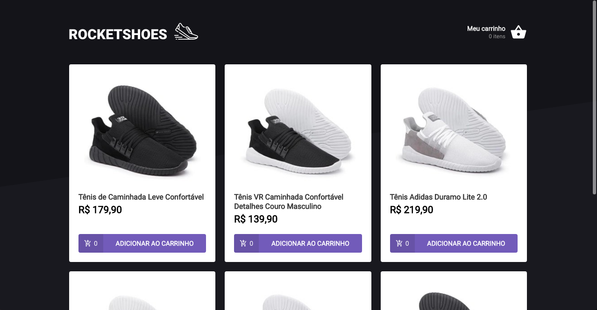
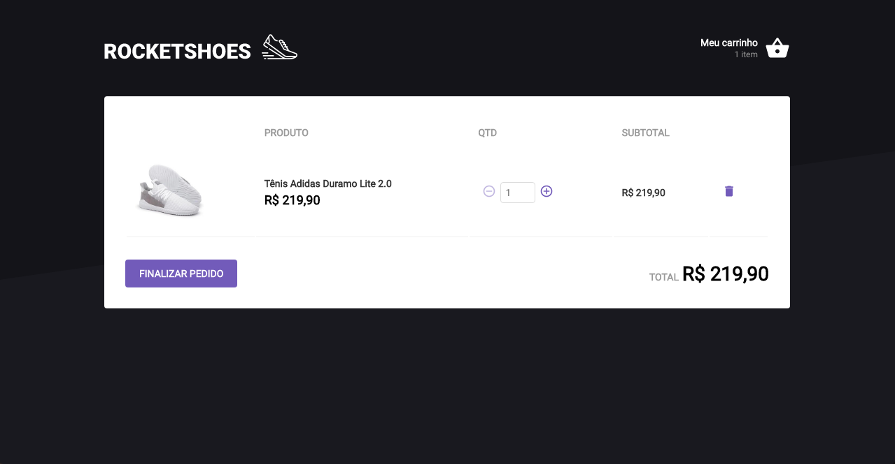

<p align="center">
   <a href="https://www.linkedin.com/in/felipe-viana/">
      
   </a>
  
  
  
  
  <a href="mailto:felipetiburcioviana@gmail.com">
   
  </a>
</p>

<!-- <p align="center">
  📰 
</p> -->

<hr />

<p align="center">
</p>

<div align="center">
  <sub> Made by
    <a href="https://github.com/felipeact">Felipe Viana 
  </sub>
</div>

# 📌 Contents

* [Screenshots](#camera-screenshot)
* [Technologies](#rocket-technologies)
* [How to Run](#computer-how-to-run)
* [Issues](#bug-issues)
* [Contributing](#sparkles-issues)
* [License](#page_facing_up-license)

# :camera: Screenshots
<div align="center">
   
   
   
</div>

# :rocket: Technologies
This project was made using the follow technologies:

* [React](https://reactjs.org/)
* [TypeScript](https://www.typescriptlang.org/)
* [Axios](https://github.com/axios/axios)

# :computer: How to run

```bash
# Clone Repository
$ git clone https://github.com/Felipeact/ignite-template-reactjs-criando-um-hook-de-carrinho-de-compras.git && cd ignite-template-reactjs-criando-um-hook-de-carrinho-de-compras

# Install Dependencies
$ npm install || yarn 

# Fill .env.local file with YOUR environment variables, according to .env.example file.

# Run Aplication
$ yarn dev
   
# Run Json server 

# :bug: Issues

Create a <a href="https://github.com/Felipeact/ignite-template-reactjs-criando-um-hook-de-carrinho-de-compras.git/issues">new issue report</a>, it will be an honor to be able to help you solve and further improve our application.

# :sparkles: Contributing

This project follows the Angular Convention commits pattern. [Click](./commitlint.config.js) to see the available prefixes.

- Fork this repository;
- Create a new branch to develop your feature: `git checkout -b my-feature`;
- Commit your changes: `git commit -m 'feat: my new feature'`;
- Push to your branch: `git push origin my-feature`.

# :page_facing_up: License

This project is under the [MIT License](./LICENSE) |
Made with by [Felipe Viana](https://www.linkedin.com/in/felipe-viana/).